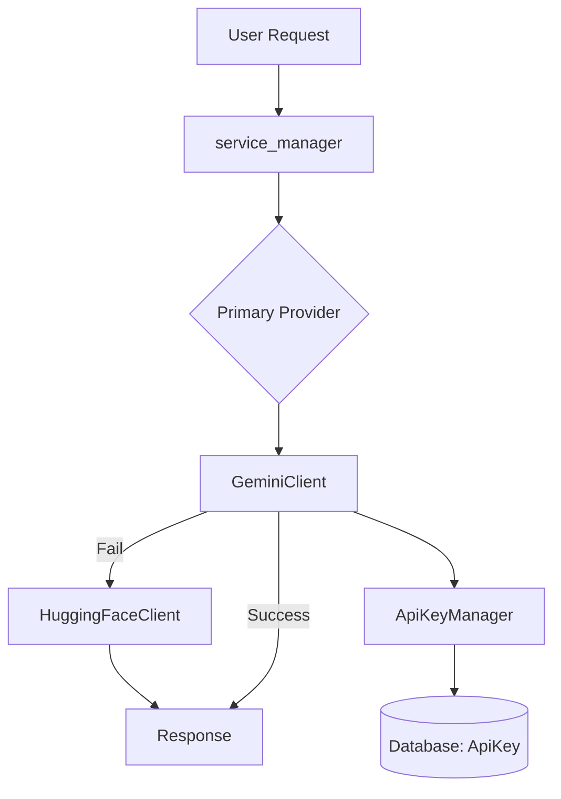

# MindStack AI Integration

## Overview

MindStack tích hợp AI để cung cấp các giải thích thông minh cho flashcard và quiz. Hệ thống hỗ trợ multiple providers với tự động fallback.

---

## 🏗️ Architecture

```
ai_services/
├── __init__.py           # Exports
├── gemini_client.py      # Google Gemini client
├── huggingface_client.py # HuggingFace client
├── hybrid_client.py      # Fallback manager
├── key_manager.py        # API key rotation
├── prompts.py            # Prompt templates
├── service_manager.py    # Service factory
└── routes.py             # AI API endpoints
```



---

## 🔧 Providers

### Google Gemini (Primary)

**Cấu hình:**
```python
# Default model (có thể thay đổi trong admin)
model_name = 'gemini-2.0-flash-lite-001'

# Fallback models (comma-separated)
model_name = 'gemini-2.0-flash-lite-001,gemini-1.5-flash-001'
```

**Ưu điểm:**
- Nhanh, chất lượng cao
- Free tier ~15 RPM / 1M tokens/day
- Hỗ trợ tiếng Việt tốt

**Nhược điểm:**
- Rate limit chặt (429 errors)
- Cần API key từ Google AI Studio

### HuggingFace (Secondary)

**Cấu hình:**
```python
# Default model
model_name = 'meta-llama/Meta-Llama-3-8B-Instruct'
```

**Ưu điểm:**
- Free tier rộng rãi hơn
- Nhiều lựa chọn model

**Nhược điểm:**
- Chậm hơn Gemini
- Chất lượng tiếng Việt kém hơn

---

## 🔑 API Key Management

### Database Schema

```sql
-- Bảng lưu API keys
CREATE TABLE api_keys (
    key_id INTEGER PRIMARY KEY,
    provider VARCHAR(50),      -- 'gemini' | 'huggingface'
    key_value TEXT,            -- API key value
    is_active BOOLEAN,         -- Enabled/disabled
    is_exhausted BOOLEAN,      -- Quota hết
    last_used_timestamp DATETIME
);
```

### Key Rotation Logic

```python
# ApiKeyManager hoạt động như sau:
1. Load tất cả keys active & not exhausted
2. Sort theo last_used_timestamp ASC (dùng ít nhất trước)
3. Pop key đầu tiên, sử dụng
4. Nếu 429 error → mark as exhausted, lấy key tiếp theo
5. Nếu hết key → return error
```

### Thêm API Key

**Qua Admin Panel:**
1. Vào `/admin/api-keys`
2. Click "Add New Key"
3. Chọn provider, paste key value
4. Save

**Qua Database:**
```python
from mindstack_app.models import ApiKey
from mindstack_app.db_instance import db

new_key = ApiKey(
    provider='gemini',
    key_value='YOUR_API_KEY',
    is_active=True,
    is_exhausted=False
)
db.session.add(new_key)
db.session.commit()
```

---

## 📝 Prompt System

### Prompt Hierarchy

```
1. Item-level prompt (item.content['ai_prompt'])
   ↓ nếu không có
2. Container-level prompt (container.ai_settings['custom_prompt'])
   ↓ nếu không có  
3. Default prompt (theo item_type)
```

### Default Prompts

**Flashcard:**
```
Với vai trò là một trợ lý học tập, hãy giải thích ngắn gọn, 
rõ ràng và dễ hiểu về thuật ngữ sau...

**Thuật ngữ:** "{front}"
**Định nghĩa:** "{back}"

Hãy trình bày câu trả lời theo định dạng Markdown.
```

**Quiz:**
```
Phân tích câu hỏi trắc nghiệm sau...

**Câu hỏi:** {question}
A. {option_a}
B. {option_b}
...

1. Tại sao đáp án '{correct_answer}' là đúng
2. Tại sao các đáp án khác sai
3. Mẹo hoặc kiến thức mở rộng
```

### Custom Prompt Variables

| Variable | Source | Description |
|----------|--------|-------------|
| `{front}` | item.content | Mặt trước flashcard |
| `{back}` | item.content | Mặt sau flashcard |
| `{question}` | item.content | Câu hỏi quiz |
| `{option_a-d}` | item.content.options | Các đáp án |
| `{correct_answer}` | item.content | Đáp án đúng |
| `{explanation}` | item.content | Giải thích có sẵn |
| `{set_title}` | container | Tên bộ flashcard |
| `{set_description}` | container | Mô tả bộ |

---

## 🚀 Usage Examples

### Trong Python Code

```python
from mindstack_app.modules.ai_services import get_ai_service

# Get service instance
ai_service = get_ai_service()

# Generate explanation
success, result = ai_service.generate_content(
    prompt="Giải thích thuật ngữ 'Machine Learning'",
    item_info="item_id=123"
)

if success:
    explanation = result
else:
    error_message = result
```

### API Endpoints

```http
POST /ai/explain
Content-Type: application/json

{
    "item_id": 123,
    "purpose": "explanation"
}

Response:
{
    "success": true,
    "explanation": "Machine Learning là..."
}
```

```http
GET /ai/models

Response:
{
    "success": true,
    "models": [
        {
            "id": "gemini-2.0-flash-lite-001",
            "display_name": "Gemini 2.0 Flash Lite",
            "description": "..."
        }
    ]
}
```

---

## 📊 Logging & Monitoring

### AI Usage Logs

```sql
-- Bảng lưu logs sử dụng AI
CREATE TABLE ai_logs (
    log_id INTEGER PRIMARY KEY,
    provider VARCHAR(50),
    model_name VARCHAR(100),
    key_id INTEGER,
    prompt_chars INTEGER,
    response_chars INTEGER,
    processing_time_ms INTEGER,
    status VARCHAR(20),        -- 'success' | 'error'
    error_message TEXT,
    item_info TEXT,
    timestamp DATETIME
);
```

### Monitoring Queries

```sql
-- Thống kê usage theo ngày
SELECT DATE(timestamp), provider, 
       COUNT(*) as requests,
       AVG(processing_time_ms) as avg_time
FROM ai_logs
GROUP BY DATE(timestamp), provider;

-- Tỷ lệ lỗi
SELECT provider,
       SUM(CASE WHEN status='success' THEN 1 ELSE 0 END) * 100.0 / COUNT(*) as success_rate
FROM ai_logs
GROUP BY provider;
```

---

## ⚠️ Error Handling

| Error | Cause | Auto-Action |
|-------|-------|------------|
| `ResourceExhausted (429)` | Quota limit | Chuyển key tiếp theo |
| `PermissionDenied` | Invalid key | Mark key exhausted |
| `ServiceUnavailable (503)` | Server down | Retry after 2s |
| All keys exhausted | No valid keys | Fallback to HuggingFace |

---

## 🔧 Configuration

### Environment Variables

```bash
# Không bắt buộc - keys được lưu trong database
# Nhưng có thể override cho development

GEMINI_API_KEY=your_key_here
HUGGINGFACE_API_KEY=your_key_here
```

### Admin Settings

Vào `/admin/ai-settings` để cấu hình:
- Default model
- Fallback models
- Custom prompts
- Rate limits

---

## 📚 References

- [Google AI Studio](https://aistudio.google.com/) - Tạo Gemini API keys
- [HuggingFace](https://huggingface.co/settings/tokens) - Tạo HF tokens
- [Gemini API Docs](https://ai.google.dev/docs)
