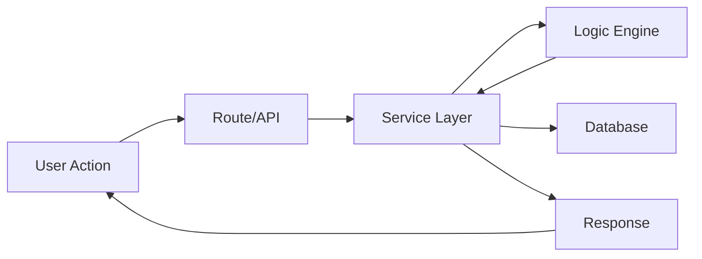
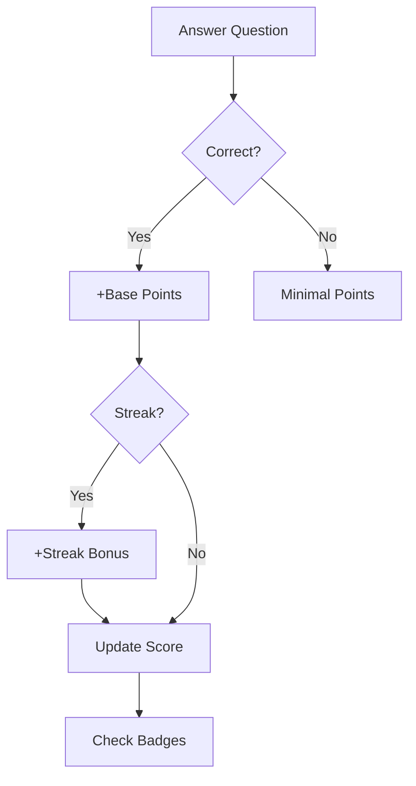

# MindStack Architecture Overview

## 📁 Project Structure

```
mindstack_app/
├── __init__.py          # Flask app factory
├── config.py            # Configuration settings
├── db_instance.py       # SQLAlchemy instance
├── extensions.py        # Flask extensions
│
├── core/                # Core infrastructure
│   ├── logging_config.py
│   └── error_handlers.py
│
├── models/              # Database models
│   ├── user.py          # User, UserSession, ScoreLog, LearningGoal
│   ├── learning.py      # LearningContainer, LearningItem, LearningGroup
│   ├── learning_progress.py  # Unified progress tracking
│   ├── gamification.py  # Badge, UserBadge
│   └── ...
│
├── modules/             # Feature modules (Blueprints)
│   ├── learning/        # Core learning features
│   │   ├── logics/      # Pure calculation engines
│   │   ├── services/    # DB layer + business logic
│   │   └── sub_modules/ # Learning modes
│   │       ├── flashcard/
│   │       ├── quiz/
│   │       └── vocabulary/
│   ├── gamification/    # Points, badges, leaderboard
│   ├── ai_services/     # AI integrations
│   ├── stats/           # Statistics & analytics
│   └── ...
│
├── services/            # Shared services
│   ├── config_service.py
│   ├── learning_metrics_service.py
│   └── memory_power_config_service.py
│
└── templates/           # Jinja2 templates
    ├── v3/              # Current UI version
    └── admin/           # Admin panel
```

---

## 🔄 Data Flow



**Layer Responsibilities:**
- **Routes**: HTTP handling, request validation
- **Services**: DB operations, business orchestration
- **Logic Engines**: Pure calculations (no DB access)

---

## 📊 Key Models

| Model | Purpose |
|-------|---------|
| `User` | Account info, preferences, scores |
| `LearningContainer` | Sets (flashcard/quiz collections) |
| `LearningItem` | Individual cards/questions |
| `LearningProgress` | Per-user item progress (unified for all modes) |

---

## 🧠 SRS System

MindStack uses a **hybrid SRS approach**:

1. **SM-2 Algorithm** (`srs_engine.py`)
   - Traditional interval scheduling
   - Easiness factor adjustments

2. **Memory Power System** (`memory_engine.py`)
   - Mastery × Retention = Memory Power
   - Intuitive progress visualization

3. **Unified SRS** (`unified_srs.py`)
   - Combines both approaches
   - SM-2 for scheduling, Memory Power for analytics

---

## 🎮 Gamification



**Point Sources:**
- Base points per learning mode
- First-time learning bonus
- Streak bonuses (correct streak, daily streak)
- Session completion bonuses

---

## 🤖 AI Integration

- **GeminiClient**: Primary AI (with model fallback)
- **HuggingFace**: Secondary/offline option
- **ApiKeyManager**: Rotation and rate limiting

Used for:
- AI explanations for cards/questions
- Content generation
- Translation assistance
