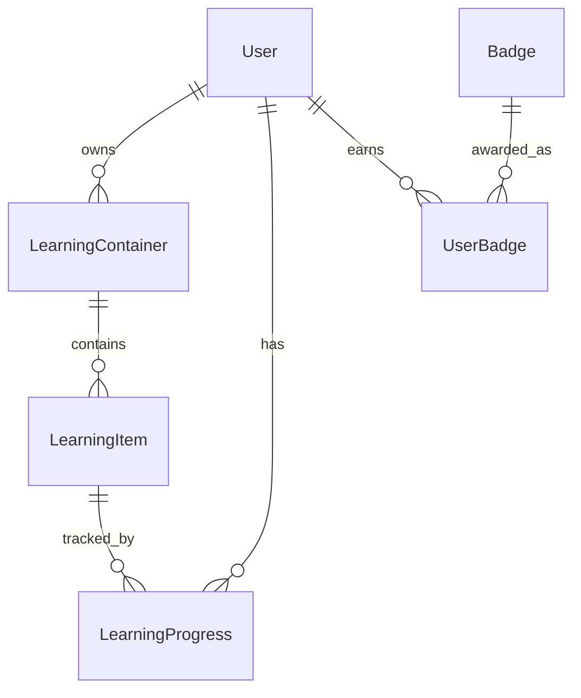

# MindStack Database Schema

## Overview

SQLite database với SQLAlchemy ORM.

---

## Core Models

### User

```
users
├── user_id (PK)
├── username
├── email
├── password_hash
├── user_role (admin/user/free)
├── total_score
├── preferences (JSON)
└── created_at
```

### LearningContainer (Sets)

```
learning_containers
├── container_id (PK)
├── owner_id (FK → users)
├── title
├── description
├── container_type (flashcard/quiz)
├── settings (JSON)
├── capabilities (JSON)
├── ai_config (JSON)
└── created_at
```

### LearningItem (Cards/Questions)

```
learning_items
├── item_id (PK)
├── container_id (FK → learning_containers)
├── group_id (FK → learning_groups, nullable)
├── content (JSON)
├── search_text
└── created_at
```

---

## Progress Tracking

### LearningProgress (Unified)

```
learning_progress
├── progress_id (PK)
├── user_id (FK → users)
├── item_id (FK → learning_items)
├── learning_mode (flashcard/quiz/typing/...)
│
├── # SRS Fields
├── status (new/learning/reviewing/mastered)
├── due_time
├── easiness_factor (default: 2.5)
├── interval (minutes)
├── repetitions
├── last_reviewed
│
├── # Memory Power
├── mastery (0.0 - 1.0)
│
├── # Statistics
├── times_correct
├── times_incorrect
├── correct_streak
└── mode_data (JSON)
```

### ReviewLog

```
review_logs
├── log_id (PK)
├── user_id (FK)
├── item_id (FK)
├── learning_mode
├── timestamp
├── quality (0-5)
├── user_answer
├── duration_ms
├── score_change
└── easiness_factor
```

---

## Gamification

### Badge

```
badges
├── badge_id (PK)
├── name
├── description
├── icon_class
├── condition_type (STREAK/TOTAL_SCORE/...)
├── condition_value
├── reward_points
└── is_active
```

### UserBadge

```
user_badges
├── id (PK)
├── user_id (FK)
├── badge_id (FK)
└── earned_at
```

### ScoreLog

```
score_logs
├── log_id (PK)
├── user_id (FK)
├── item_id (nullable)
├── score_change
├── reason
├── item_type
└── timestamp
```

---

## Relationships



---

## Indexes

| Table | Index | Purpose |
|-------|-------|---------|
| learning_progress | (user_id, learning_mode, due_time) | Due items query |
| learning_progress | (user_id, learning_mode, status) | Status filter |
| review_logs | (user_id, item_id, timestamp) | History lookup |
| score_logs | (user_id, timestamp) | Leaderboard |
