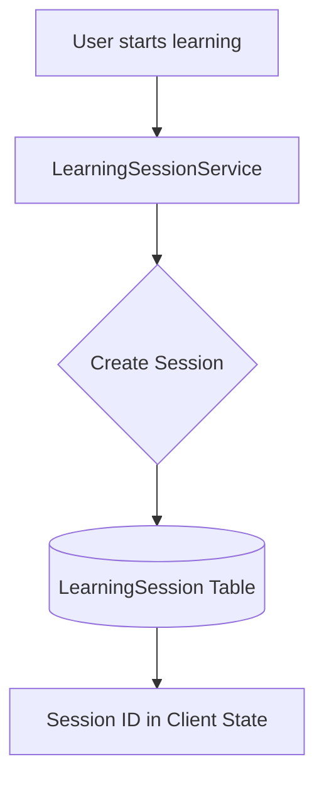

# MindStack Session Management (v2.0)

## Overview

MindStack uses **Database-Backed Learning Sessions** to track progress, ensure cross-device synchronization, and prevent progress loss.

---

## 🏗️ Architecture



**Key Difference (v2.0):** Sessions are no longer stored in Flask Cookies but are persisted in the database as `LearningSession` objects.

---

## 🔐 The `LearningSession` Model

| Attribute | Description |
|-----------|-------------|
| `session_id` | Unique ID (DB Primary Key) |
| `user_id` | Owner of the session |
| `learning_mode` | `flashcard`, `mcq`, `quiz`, `typing`, etc. |
| `mode_config_id` | Specific sub-mode (e.g., `new_only`, `due_only`) |
| `set_id_data` | JSON field: single ID, list of IDs, or 'all' |
| `status` | `active`, `completed`, `cancelled` |
| `processed_item_ids` | JSON list of items already answered |

---

## 🔄 Session Policies

### Single Active Session Policy
To maintain data integrity, MindStack enforces a single active session policy for vocabulary modes:
- If a user starts a new `Flashcard` session for Set A, any existing `MCQ` or `Typing` session for Set A is automatically cancelled.
- **Why?** Prevents SRS scheduling conflicts and duplicate streak calculation.

---

## 📚 Using `LearningSessionService`

### 1. Starting a Session
```python
from mindstack_app.modules.vocab_flashcard.services.session_service import LearningSessionService

session = LearningSessionService.create_session(
    user_id=current_user.user_id,
    learning_mode='flashcard',
    mode_config_id='new_only',
    set_id_data=123,
    total_items=50
)
```

### 2. Updating Progress
As the user answers questions, the `processed_item_ids` list is updated in the DB.
```python
# Typically handled within the answer submission route
session.processed_item_ids.append(item_id)
db.session.commit()
```

### 3. Resuming Sessions
The dashboard checks for active sessions via `/learn/api/active`.
- If found, the user is prompted to "Resume" or "Start New".

---

## 🚀 Learning Modes & Endpoints

| Mode | Blueprint | Setup URL | Session URL |
|------|-----------|-----------|-------------|
| **Flashcard** | `vocab_flashcard` | `/learn/vocabulary/flashcard/setup/<id>` | `/learn/vocab-flashcard/vocabulary/flashcard/session/<session_id>` |
| **MCQ** | `vocab_mcq` | `/learn/vocabulary/mcq/setup/<id>` | `/learn/vocab-mcq/mcq/session/<id>` |
| **Quiz** | `quiz` | `/learn/quiz/set/<id>` | `/learn/quiz/session/<session_id>` |

---

## 🔧 Session Recovery

### Cross-Device Sync
Because sessions are in the DB, a user can start a session on a desktop and resume it on mobile without losing progress.

### Automatic Cleanup
When a new session starts, `LearningSessionService.cancel_active_sessions()` ensures old orphaned sessions are closed.