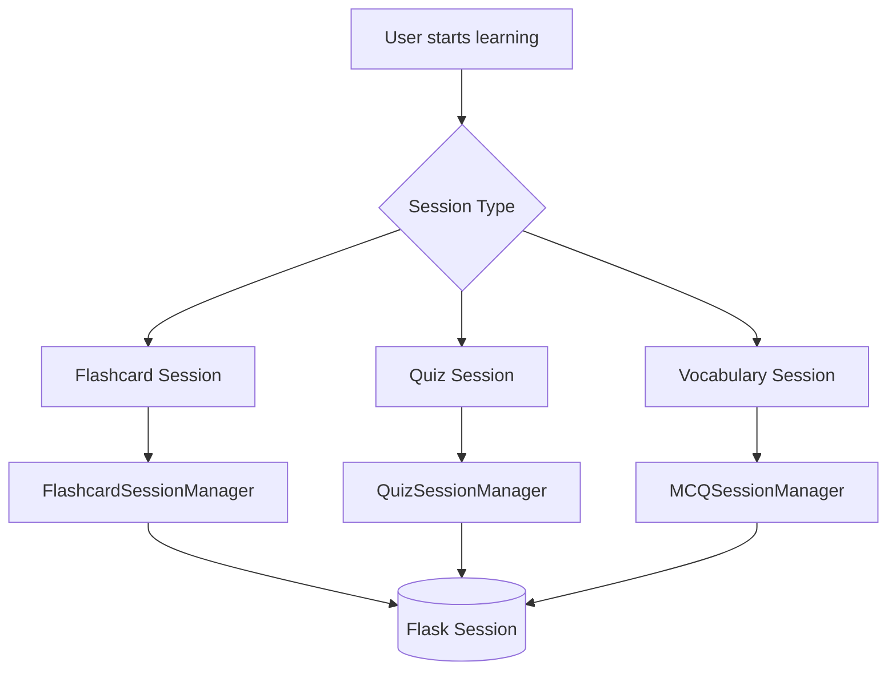

# MindStack Session Management

## Overview

Quản lý sessions học tập trong MindStack, bao gồm Flashcard, Quiz, và Vocabulary sessions.

---

## 🏗️ Architecture



---

## 📚 Session Types

### Flashcard Session

**Location:** `modules/learning/sub_modules/flashcard/engine/session_manager.py`

**Session Key:** `flashcard_session`

**Session Data:**
```python
{
    'user_id': 1,
    'set_id': 123,  # hoặc 'all' hoặc [1, 2, 3]
    'mode': 'new_only',
    'total_items_in_session': 50,
    'processed_item_ids': [1, 2, 3],  # Items đã xử lý
    'correct_answers': 10,
    'incorrect_answers': 2,
    'vague_answers': 1,
    'start_time': '2026-01-08T12:00:00Z',
    'session_points': 150
}
```

**Learning Modes:**
| Mode | Description | Algorithm |
|------|-------------|-----------|
| `new_only` | Chỉ thẻ mới | `get_new_only_items()` |
| `due_only` | Thẻ đến hạn | `get_due_items()` |
| `hard_only` | Thẻ khó | `get_hard_items()` |
| `mixed_srs` | Kết hợp SRS | `get_mixed_items()` |
| `all_review` | Tất cả đã học | `get_all_review_items()` |
| `autoplay_all` | Tự động phát | `get_all_items_for_autoplay()` |

---

### Quiz Session

**Location:** `modules/learning/sub_modules/quiz/individual/logics/session_logic.py`

**Session Key:** `quiz_session`

**Session Data:**
```python
{
    'user_id': 1,
    'set_id': 123,
    'mode': 'batch',  # 'batch' | 'single'
    'batch_size': 10,
    'current_batch': [...],
    'answered_items': [],
    'start_time': '...',
    'sync_id': 'abc123'  # Short ID for URL sharing
}
```

---

### Vocabulary Sessions

**MCQ Session:** `vocabulary/mcq/mcq_session_manager.py`
**Typing Session:** Uses similar patterns
**Listening Session:** Uses similar patterns

---

## 🔄 Session Lifecycle

### 1. Start Session

```python
from mindstack_app.modules.learning.sub_modules.flashcard.engine.session_manager import FlashcardSessionManager

# Bắt đầu session mới
success, message = FlashcardSessionManager.start_new_flashcard_session(
    set_id=123,
    mode='new_only'
)

if success:
    print("Session started!")
else:
    print(f"Error: {message}")
```

### 2. Get Next Batch

```python
# Lấy session hiện tại
session_data = FlashcardSessionManager.get_session_status()
if session_data:
    manager = FlashcardSessionManager.from_dict(session_data)
    batch = manager.get_next_batch()
    
    if batch:
        items = batch['items']
        # Process items...
    else:
        # Session completed
        pass
```

### 3. Process Answer

```python
result = manager.process_flashcard_answer(
    item_id=123,
    user_answer_quality=4,  # 0-5 scale
    duration_ms=3500,
    user_answer_text="optional answer"
)

if result.get('success'):
    score_change = result['score_change']
    new_status = result['new_progress_status']
    memory_power = result['memory_power']
```

### 4. End Session

```python
FlashcardSessionManager.end_flashcard_session()
```

---

## 🔐 Session Storage

### Flask Session

MindStack sử dụng Flask's session object (cookie-based):

```python
from flask import session

# Lưu session data
session['flashcard_session'] = session_data
session.modified = True

# Đọc session data
data = session.get('flashcard_session')

# Xóa session
session.pop('flashcard_session', None)
```

### Session Configuration

```python
# config.py
SECRET_KEY = 'your-secret-key'  # Mã hóa session cookie
```

---

## 🔄 Session Sync (Cross-Device)

### Short Session IDs

Cho phép chia sẻ session qua URL:

```python
# Generate short ID
import secrets
sync_id = secrets.token_urlsafe(6)  # e.g., "abc123"

# URL format
# /quiz/session/abc123
```

### Active Batch Cache

Cache batch data trong database để resume session:

```python
# Lưu batch vào cache
cache_data = {
    'batch_items': [...],
    'answered_items': [...],
    'created_at': datetime.now()
}

# Retrieve khi resume
cached = get_active_batch(sync_id)
if cached:
    resume_from_cache(cached)
```

---

## 📊 Session Statistics

### Real-time Stats

Mỗi session tracking:

```python
# Trong session data
{
    'correct_answers': 10,
    'incorrect_answers': 2,
    'vague_answers': 1,
    'session_points': 150
}

# Tính toán
total_answered = correct + incorrect + vague
accuracy = correct / total_answered * 100
```

### Memory Power Data

Mỗi answer trả về memory power metrics:

```python
{
    'memory_power': {
        'current': 0.75,
        'previous': 0.60,
        'change': 0.15,
        'mastery': 0.80,
        'retention': 0.94
    }
}
```

---

## 🔧 Session Recovery

### Page Reload

Session survives page reload:

```python
# Khi page load, check existing session
session_data = FlashcardSessionManager.get_session_status()
if session_data:
    # Resume existing session
    manager = FlashcardSessionManager.from_dict(session_data)
else:
    # Start new session
    pass
```

### Prevent Duplicate Processing

Items chỉ được thêm vào `processed_item_ids` SAU KHI answer được submit:

```python
# WRONG: Add before answer (causes skips on reload)
self.processed_item_ids.append(item_id)  # ❌

# CORRECT: Add after answer
if answer_result_type in ('correct', 'incorrect', 'vague'):
    if item_id not in self.processed_item_ids:
        self.processed_item_ids.append(item_id)  # ✅
```

---

## 🎮 Session Modes Configuration

### Flashcard Modes

```python
# config.py trong flashcard module
FLASHCARD_MODES = [
    {'id': 'new_only', 'name': 'Học mới', 'icon': '📚'},
    {'id': 'due_only', 'name': 'Ôn tập', 'icon': '🔄'},
    {'id': 'hard_only', 'name': 'Luyện khó', 'icon': '🔥'},
    {'id': 'mixed_srs', 'name': 'Trộn SRS', 'icon': '🎲'},
    {'id': 'all_review', 'name': 'Xem lại', 'icon': '👀'},
]
```

### Quiz Modes

```python
QUIZ_MODES = [
    {'id': 'batch', 'name': 'Theo batch', 'batch_size': 10},
    {'id': 'single', 'name': 'Từng câu', 'batch_size': 1},
]
```

---

## ⚠️ Common Issues

### Session Lost

**Nguyên nhân:**
- Cookie bị xóa
- SECRET_KEY thay đổi
- Session timeout

**Giải pháp:**
```python
# Đảm bảo SECRET_KEY cố định
SECRET_KEY = os.environ.get('SECRET_KEY', 'fixed-dev-key')
```

### Concurrent Session Conflicts

**Nguyên nhân:** Mở nhiều tabs cùng lúc

**Giải pháp:**
```python
# Check session version
if session.get('session_version') != expected_version:
    # Reload or warn user
    pass
```

---

## 📚 API Endpoints

| Endpoint | Method | Description |
|----------|--------|-------------|
| `/flashcard/set/<id>/session` | GET | Start session |
| `/flashcard/api/batch` | POST | Get next batch |
| `/flashcard/api/submit` | POST | Submit answer |
| `/flashcard/api/end-session` | POST | End session |
| `/quiz/set/<id>/session` | GET | Start quiz |
| `/quiz/api/batch` | POST | Get quiz batch |
| `/quiz/api/submit` | POST | Submit quiz answers |

---

## 📚 References

- [Flask Session](https://flask.palletsprojects.com/en/2.0.x/quickstart/#sessions)
- [SRS_ALGORITHM.md](SRS_ALGORITHM.md) - SRS logic details
- [LEARNING_MODES.md](LEARNING_MODES.md) - Mode descriptions
