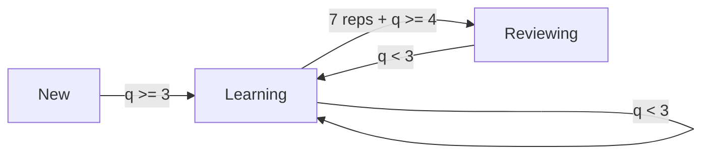

# MindStack SRS Algorithm

## Overview

MindStack sử dụng **Hybrid SRS** kết hợp 2 hệ thống:
- **SM-2**: Scheduling truyền thống (khi nào ôn)
- **Memory Power**: Analytics trực quan (nhớ tốt thế nào)

---

## SM-2 Algorithm

### Core Formula

```
EF' = EF + (0.1 - (5-q) * (0.08 + (5-q) * 0.02))
```

| Variable | Meaning |
|----------|---------|
| `EF` | Easiness Factor (1.3 - 2.5+) |
| `q` | Quality (0-5) |
| `EF'` | New easiness factor |

### Quality Scale

| Quality | Description | Effect |
|---------|-------------|--------|
| 5 | Perfect/Easy | EF ↑, Interval ↑↑ |
| 4 | Good | EF ↑, Interval ↑ |
| 3 | Hard | EF →, Interval → |
| 2 | Vague | Reset to learning |
| 1 | Again | Reset to learning |
| 0 | Complete fail | Reset to learning |

### Status Transitions



---

## Memory Power System

### Formula

```
Memory Power = Mastery × Retention
```

### Mastery Calculation

| Status | Mastery Range |
|--------|---------------|
| New | 0% |
| Learning (rep 1-7) | 10% → 52% |
| Reviewing | 60% → 100% |

### Retention (Forgetting Curve)

```
R = e^(-t/S)
```

| Variable | Meaning |
|----------|---------|
| `R` | Retention probability |
| `t` | Time since last review |
| `S` | Stability (from interval) |

Assumes **90% retention** at scheduled due time.

---

## Learning Intervals

| Step | Interval |
|------|----------|
| 1 | 10 minutes |
| 2 | 1 hour |
| 3 | 4 hours |
| 4 | 8 hours |
| 5 | 1 day |
| 6 | 2 days |
| Graduate | 4 days |

---

## Quality Normalization by Mode

| Mode | Input | Quality Mapping |
|------|-------|-----------------|
| Flashcard | User rating | Direct (1-5) |
| MCQ/Quiz | Correct/Wrong | 4 / 1 |
| Typing | Accuracy % | ≥100%→5, ≥85%→4, else→1 |
| Listening | Accuracy % | Same as Typing |

---

## Code References

- [srs_engine.py](../mindstack_app/modules/learning/logics/srs_engine.py) - SM-2 calculations
- [memory_engine.py](../mindstack_app/modules/learning/logics/memory_engine.py) - Memory Power
- [unified_srs.py](../mindstack_app/modules/learning/logics/unified_srs.py) - Hybrid system
