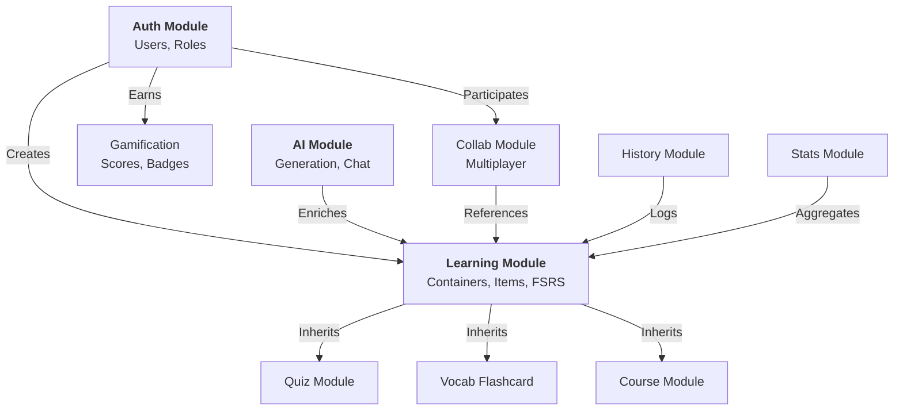

# Tài liệu Mối quan hệ giữa các Module trong MindStack

Tài liệu này mô tả chi tiết các mối liên kết (dependencies), luồng dữ liệu, và sự tương tác giữa các module trong hệ thống Modular Monolith của MindStack.

## 1. Tổng quan Kiến trúc

MindStack sử dụng kiến trúc **Modular Monolith** với phong cách **Hexagonal Architecture** (mỗi module có Core, Interface, Infrastructure riêng biệt). Các module giao tiếp với nhau chủ yếu thông qua:
1.  **Shared Kernel (Core)**: Các model và tiện ích dùng chung (`mindstack_app.core`).
2.  **Public Interfaces**: Các hàm public được expose (ví dụ: `AIInterface`, `Service Layers`).
3.  **Database Relationships (Foreign Keys)**: Liên kết trực tiếp giữa các bảng dữ liệu.
4.  **Signals/Events**: Giao tiếp lỏng lẻo (Loose coupling) để tránh phụ thuộc vòng tròn (circular dependencies).

---

## 2. Mô hình Core & Các Vệ tinh

Hệ thống xoay quanh 3 trụ cột chính:
1.  **Auth Module** (Người dùng & Định danh).
2.  **Learning Core** (Nội dung & Tiến trình học tập).
3.  **Infrastructure Modules** (AI, Ops, Notifications).

---

## 3. Chi tiết Mối quan hệ

### 3.1 Learning Module (Trung tâm)
Đây là module quan trọng nhất, chứa các định nghĩa trừu tượng (`LearningContainer`, `LearningItem`) mà các module khác kế thừa hoặc tham chiếu.

*   **Với Auth**:
    *   `LearningContainer` thuộc về một `User` (Creator).
    *   `LearningProgress` (FSRS) gắn kết 1 `User` với 1 `LearningItem`.
*   **Với Content Modules (Quiz, Flashcard, Course)**:
    *   Sử dụng cơ chế **Polymorphism** (Đa hình) của SQLAlchemy.
    *   `QuizSet`, `FlashcardSet`, `Course` kế thừa từ `LearningContainer`.
    *   `QuizMCQ`, `Flashcard`, `Lesson` kế thừa từ `LearningItem`.
*   **Với AI**:
    *   `LearningItem` có thuộc tính ảo `ai_explanation` gọi sang `AIInterface` để lấy nội dung giải thích.
    *   Container cấu hình `ai_capabilities` để bật/tắt các tính năng AI.

### 3.2 AI Module (Hạ tầng Thông minh)
Cung cấp dịch vụ trí tuệ nhân tạo cho toàn bộ hệ thống.

*   **Với Learning**: Sinh nội dung tự động (Flashcard từ văn bản, giải thích Quiz).
*   **Với Translator**: Cung cấp dịch vụ dịch thuật (Google Gemini/OpenAI).
*   **Với Auth**: Quản lý API Key và quota theo từng User (hoặc hệ thống chung).

### 3.3 Gamification Module (Động lực)
Hoạt động dựa trên sự kiện (Event-driven) từ các module khác.

*   **Lắng nghe từ Learning**: Khi User hoàn thành 1 phiên học (`LearningSession`), Gamification tính điểm và cập nhật `TotalScore`.
*   **Lắng nghe từ Stats**: Khi User đạt mốc thống kê (ví dụ: 7 ngày streak), Gamification cấp `Badge`.

### 3.4 Collab Module (Hợp tác & Thi đấu)
Module phức tạp nhất về mặt tương tác thời gian thực.

*   **Với Auth**: Quản lý danh sách người tham gia (`Participants`) trong phòng.
*   **Với Learning**:
    *   Tham chiếu đến `LearningContainer` để lấy nội dung câu hỏi/thẻ học.
    *   Không sửa đổi nội dung gốc, chỉ đọc dữ liệu để tạo ra "Round" thi đấu.

### 3.5 FSRS Module (Thuật toán lặp lại ngắt quãng)
Chịu trách nhiệm tính toán lịch học tối ưu.

*   **Độc lập cao**: Nhận đầu vào là lịch sử học tập (`StudyLogs`) và trạng thái hiện tại (`ItemMemoryState`).
*   **Output**: Cập nhật lại `ItemMemoryState` (độ khó, độ ổn định, ngày ôn tập tiếp theo) cho `Learning` module sử dụng.

---

## 4. Bảng Ma trận Phụ thuộc (Dependency Matrix)

| Module Nguồn | Phụ thuộc vào | Mục đích | Loại liên kết |
| :--- | :--- | :--- | :--- |
| **Quiz/Flashcard** | Learning | Kế thừa cấu trúc dữ liệu | Kế thừa (Inheritance) |
| **Learning** | Auth | Xác định chủ sở hữu nội dung | Foreign Key |
| **AI** | Learning | Gắn nội dung AI vào Item | Foreign Key / Interface |
| **Collab** | Learning | Lấy nội dung để thi đấu | Foreign Key |
| **Gamification** | Learning | Tính điểm từ kết quả học | Event Listener |
| **History** | Learning | Ghi nhật ký học tập chi tiết | Foreign Key |
| **Stats** | Learning/History | Tổng hợp báo cáo | Aggregation Query |
| **Notification** | Auth | Gửi thông báo cho User | Foreign Key |

---

## 5. Lưu ý cho Developer

1.  **Tránh Circular Import**:
    *   Không `import` trực tiếp module này trong module kia nếu cả hai phụ thuộc nhau.
    *   Sử dụng `TYPE_CHECKING` block cho Type Hinting.
    *   Sử dụng `string reference` trong SQLAlchemy relationship (ví dụ: `relationship('User')` thay vì `relationship(User)`).

2.  **Sử dụng Interface**:
    *   Khi Module A cần gọi hàm của Module B (ví dụ: Learning gọi AI), hãy dùng `Interface` pattern (như `AIInterface`) thay vì import trực tiếp Service của B.

3.  **Event Driven**:
    *   Ưu tiên dùng `blinker` signals cho các tác vụ phụ (cộng điểm, gửi thông báo, ghi log) để giảm độ trễ cho request chính.
